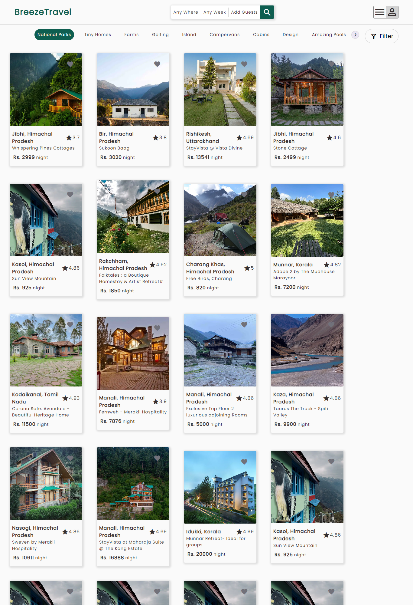
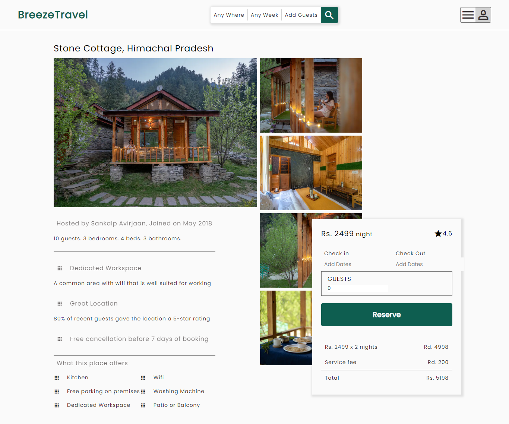
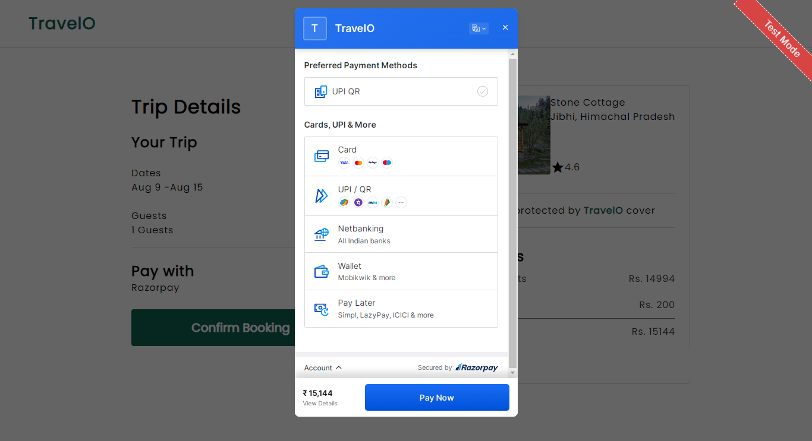

# Fun Food

A Travel App book your stays here !!!
Breeze shows you the quickest, cheapest and most eco-friendly options for the journey you want to take. Find live, local information you can rely on. Find stops and public transport options available near you.

# Home

# Single Hotel Page

# Payment

## Tech Stack

- HTML/CSS
- ReactJS
- NodeJS
- MongoDB
- ExpressJS

## Author

-   Himanshika Rawat - follow me on 👇
-   [GitHub](https://www.github.com/himanshirawat)
-   [LinkedIn](https://www.linkedin.com/in/himanshi-rawat/)
-   [Pinterest](https://in.pinterest.com/himanshikarawat/)

## Available Scripts

In the project directory, you can run:

### `npm start`

Runs the app in the development mode.\
Open [http://localhost:3000](http://localhost:3000) to view it in your browser.

The page will reload when you make changes.\
You may also see any lint errors in the console.

